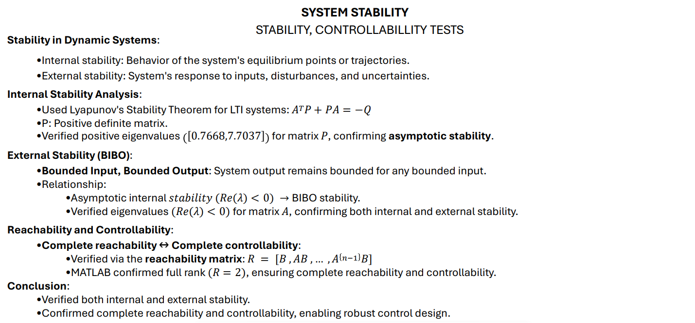
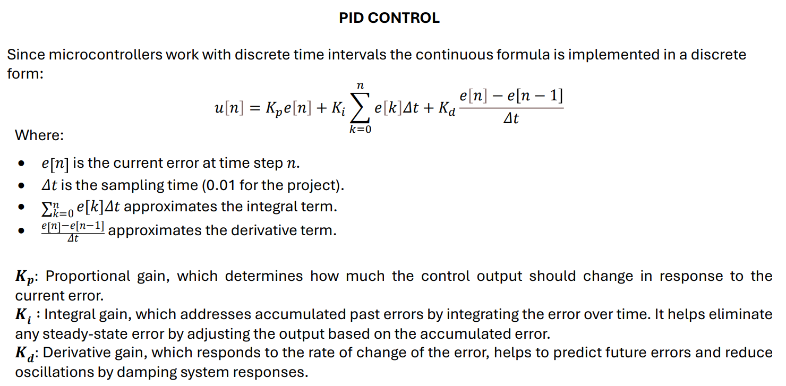

# Aeropendulum
Aeropendulum - PID control for angular position

<p align="center">
  
</p>
</br>
This project is centered on the development of a PID controller for the angular position of an aeropendulum. The primary goal was to apply concepts from system dynamics, control theory, and embedded systems programming.

The system's behavior was analyzed by deriving its mathematical model and performing simulations in MATLAB. Control theory principles, including Lyapunov stability, reachability, and controllability theorems, were used to evaluate the system's dynamics and characteristics. These analyses contributed to determining the appropriate sampling time for the system and served as a foundation for implementing a PID control algorithm.

The control logic was implemented using low-level programming techniques, leveraging direct register manipulation for peripheral configuration, including timers, interrupts, PWM signals, I2C, and USART communication protocols. This approach ensured efficient and precise control over the system's performance.

Following the implementation of the control logic, sensor fusion was employed to combine data from the accelerometer and gyroscope. A complementary filter was used to accurately determine the tilt position of the aeropendulum, providing reliable feedback for the control system.

A simple interface was developed in LabVIEW to facilitate system activation and deactivation, as well as to provide real-time feedback on the system's movement.

## Mathematical Model
To effectively control the propeller pendulum system, an accurate mathematical model of the dynamics of the system is first obtained.


  
## System Simulation
To carry out the simulation was designed a Simulink diagram that repre-sents the non-linear model from the system.  


## Stability 
The analysis using the Lyapunov criteria, along with reachability and controllability assessments, provides a comprehensive understanding of the aeropendulum’s dynamics and control capabilities. The system's stability, confirmed through Lyapunov's method, ensures that the pendu-lum can be maintained in the upright position over time. The confirmed reachability and controllability further guarantee that the system can be effectively controlled and maneuvered to achieve various states. These results validate the effectiveness of the control strategies implemented in the project and support the reliability and robustness of the embedded system design. 


# Hardware Setup
The aeropendulum system integrates several key components to achieve precise control and stabilization of an inverted pendulum mounted on a rotating base. The primary components include the STM32F446RE mi-crocontroller, the MPU6050 sensor, a brushless motor, and an Electronic Speed Controller (ESC). Each component plays a crucial role in the sys-tem's overall functionality.  


# Software design and implementation
The software for controlling the aeropendulum was developed using C and is executed on the STM32F445RE microcontroller. The system’s de-sign is centered around acquiring sensor data from the MPU6050, pro-cessing it with a complementary filter, and then using a PID controller to adjust the speed of brushless motor via PWM signals. A breakdown of the key components of the software implemented in [main](https://github.com/RicardoBalderrabano/Aeropendulum/blob/9544bedcff48c3004356c57dc7b6dc98bf6e49e6/PID_2/Core/Src/main.c) is described: 

## Main control loop
The core of the program operates within a loop that continuously reads sensor data, calculates the requires motor speed using PID control, and applies the PWM signal to the motor to maintain the stability. 

```c
  // Main loop to process incoming commands and execute PID control
  while (1) {
      // Check if new data has been received via USART
      if (new_data_available) {
    	  // Execute control logic when new data is available and the timer interrupt has fired (every 0.01 s)
          if (data_buff[0] == '1' && Tc_flag == 1) {

        	  float r = 45;								  // Desired setpoint (target angle)
              y = Get_Angle_Inclination();	              // Measure the current angle
              u = PID_Control(r, y);					  // Compute the control effort using PID
              TIM1->CCR1 = u;							  // Apply the control effort by setting the PWM duty cycle
              sprintf(buff_tx, "%1.3f\r\n", y);			  // Format the measured angle and send it via USART for feedback
              send_str_it(buff_tx, strlen(buff_tx));
              Tc_flag = 0;								  // Reset the control flag for the next cycle
          }
          else if (data_buff[0] == '0' && Tc_flag == 1) { // Command '0': Set motor PWM to a fixed value if Tc_flag is set

              TIM1->CCR1 = 500;							  // Set PWM to a fixed value (Stop the motor)
              Tc_flag = 0;								  // Reset the control flag
          }
      }
  }
```

## Sampling time

For deriving the sampling time of the algorithm, it must be considering the dynamics of the system. For this reason, a model was developed in Matlbab-Simulink with the real value parameters of the system where the following eigenvalues were obtained:


In the [main](https://github.com/RicardoBalderrabano/Aeropendulum/blob/9544bedcff48c3004356c57dc7b6dc98bf6e49e6/PID_2/Core/Src/main.c) control loop, the Tc_flag is set by an Interrupt Service Routine (ISR) to implement a 0.01-second sampling interval for the PID control. To achieve this, the timer and its associated ISR were configured to generate an event every 0.01 seconds, based on a microcontroller clock speed of 84 MHz. The following calculations were used to determine the appropriate settings for the timer configuration:


### Timer Configuration and Interrupt Service Routine (ISR) 
```c
// Configure TIMER 2 to generate an update event every 0.01 seconds
void TIM2_PID_setup(void) {

    RCC->APB1ENR |= (1 << RCC_APB1ENR_TIM2EN_Pos);	// Enable the clock for TIM2 peripheral
    TIM2->PSC = 8400 - 1;					// Set prescaler to slow the 84 MHz clock down to 10 kHz (84 MHz / 8400)
    TIM2->ARR = 100 - 1;					// Set auto-reload register to 100 for a 0.01-second interval (10 kHz / 100 = 100 Hz or 0.01 s)
    TIM2->DIER |= (1 << TIM_DIER_UIE_Pos);	// Enable update interrupt on timer overflow
    TIM2->CR1 |= (1 << TIM_CR1_CEN_Pos);	// Start the timer by enabling the counter
    NVIC_SetPriority(TIM2_IRQn, 0);			// Set priority level 0 for TIM2 interrupt
    NVIC_EnableIRQ(TIM2_IRQn);				// Enable the TIM2 interrupt in the NVIC to handle the timer events
}

// ISR for Timer 2, triggered every 0.01 seconds based on timer overflow
volatile uint8_t Tc_flag = 0;					//Control Loop Flag

void TIM2_IRQHandler(void) {					// TIM2 Interrupt Handler - Called when a timer overflow occurs for TIM2
    if (TIM2->SR & TIM_SR_UIF) {				// Check if the update interrupt flag (UIF) is set (timer overflowed)
        TIM2->SR &= ~(1 << TIM_SR_UIF_Pos);	    // Clear the update interrupt flag to allow the next interrupt
        Tc_flag = 1;	        				// Set flag to signal the control loop to run
    }
}
```
This ISR ensures that the control loop executes at regular intervals of 0.01 seconds, enabling timely updates and maintaining the performance of the PID control system.

## Sensor Data Acquisition
The MPU6050 sensor is used to measure the tilt angle of the pendu-lum. It provides both accelerometer and gyroscope data, which are fused using a complementary filter to compute the pendulum’s inclination angle. The sensor is read via I2C communication.

```c
// Function to calculate the tilt angle using accelerometer and gyroscope data
float Get_Angle_Inclination() {
    // Read raw and scaled data from the MPU6050 sensor
    MPU6050_Read_RawData(&Accel_Raw, &Gyro_Raw);
    MPU6050_Read_ScaledData(&Accel_Scaled, &Gyro_Scaled);

    // Extract accelerometer data
    float accelY = Accel_Scaled.y;
    float accelZ = Accel_Scaled.z;

    // Compute tilt angle from accelerometer data
    float newAngle = (atan2(accelY, accelZ) * (180.0 / M_PI)) + 90.0f;

    // Get gyroscope angular velocity
    float newRate = Gyro_Scaled.x;
    float dtC = 0.01;  // Time interval (seconds)

    // Compute filter coefficient
    a = tau / (tau + dtC);		// 0.9

    // Apply complementary filter to combine accelerometer and gyroscope data
    x_angleC = a * (x_angleC + newRate * dtC) + (1 - a) * newAngle;

    // Clamp the angle to ensure it remains within bounds
    if (x_angleC < 0.0f) x_angleC = 0.0f;
    if (x_angleC > 1.0f) x_angleC = x_angleC;

    return x_angleC;
}
```
## Complementary Filter
To smooth out the sensor data and combine accelerometer and gyro-scope information, a complementary filter is implemented. The filter fuses the short-term accuracy of the gyroscope with the long-term stability of the accelerometer to estimate the tilt angle.

```c    
    // Compute filter coefficient
    a = tau / (tau + dtC);		// 0.9

    // Apply complementary filter to combine accelerometer and gyroscope data
    x_angleC = a * (x_angleC + newRate * dtC) + (1 - a) * newAngle;
```
## PID Controller
The PID controller calculates the control output (motor speed) based on the error between the desired angle (setpoint) and the current angle (process variable). The proportional, integral, and derivative terms are computed and summed to generate the control signal. The output of the PID controller is then converted to a PWM signal to control the motor's speed.



```c
/* Function to implement PID control */
float PID_Control(float setpoint, float process_variable) {
    float error = setpoint - process_variable;	    					// Calculate the error between the desired setpoint and the current process variable
    integral += error * 0.01; 											// Integral term accumulates the error over time
    float derivative = (error - previous_error) / 0.01; 				// Derivative term estimates how quickly the error is changing
    control_output = Kp * error + Ki * integral + Kd * derivative;	    // control_output combines proportional, integral, and derivative terms
    uint32_t pwm_value = voltage_to_pwm(control_output);		    	// Compute the PWM value from the voltage required
    previous_error = error;				    							// Store the current error to use as the previous error in the next iteration
    return pwm_value;			    									// Return the PWM value that will be used to control the motor
}
```
## PID Tunning

To tune the PID coefficients, the Ziegler-Nichols method was used. It involves determining the critical gain (K_u) and critical period (T_u) of the system by setting the integral and derivative gains to zero and gradually increasing the proportional gain until the system reaches sustained oscillations.


## Compute PWM from voltage required
The voltage_to_pwm function converts a control voltage into a PWM signal, ensuring the output stays within a defined range. 
```c
// RELATIONSHIP BRUSHLESS MOTOR A2212 - MAX RPM
#define MAX_RPM 12000  // Maximum RPM at full throttle with 12V supply (1000 KV * 12V)
#define K_t 0.00955    // Torque constant in Nm/A
// PWM LIMITS (1ms to 2ms)
#define MIN_PWM 598    // Minimum PWM value (corresponding to minimum duty cycle - 1ms pulse width)
#define MAX_PWM 646    // Maximum PWM value (corresponding to maximum duty cycle - 2ms pulse width)

// Function to map the control input (voltage) to a PWM signal
float voltage_to_pwm(float voltage){
    if (voltage > MAX_RPM) voltage = MAX_RPM;  // Clamp RPM to max RPM
    if (voltage < 0) voltage = 0;              // Clamp RPM to min RPM
    return (uint32_t)((voltage / MAX_RPM) * (MAX_PWM - MIN_PWM) + MIN_PWM);	// Map the RPM to the PWM range [MIN_PWM, MAX_PWM]
}
```
## Timer configuration for PWM generation


Below is the section code where the timer is configured:

```c
// TIMER CONFIGURATION FOR PWM
void TIM1_PWM_setup() {

    /* TIM1 SetUp */
    RCC->APB2ENR |= (1 << RCC_APB2ENR_TIM1EN_Pos);     // Enable clock to TIM1

    /* GPIO SetUp (PA8 -> TIM1_CH1) */
    RCC->AHB1ENR |= (1 << RCC_AHB1ENR_GPIOAEN_Pos);    // Enable GPIOA clock
    GPIOA->MODER |= (2 << 16);                         // Set PA8 to Alternate function mode
    GPIOA->AFR[1] |= (1 << 0);                         // Set AF1 (TIM1_CH1) for PA8
    GPIOA->OSPEEDR |= (3 << 16);                       // High Speed for PA8

    /* CR1 Configuration */
    TIM1->CR1 &= ~(1 << TIM_CR1_UDIS_Pos);             // Update event enabled
    TIM1->CR1 &= ~(1 << TIM_CR1_URS_Pos);              // Generation of an update interrupt
    TIM1->CR1 &= ~(1 << TIM_CR1_DIR_Pos);              // Upcounting direction
    TIM1->CR1 &= ~(0x03 << TIM_CR1_CMS_Pos);           // Edge-aligned mode
    TIM1->CR1 |= (1 << TIM_CR1_ARPE_Pos);              // Auto-reload preload enabled

    /* Channel 1 Configuration */
    TIM1->CCMR1 &= ~(0x03 << TIM_CCMR1_CC1S_Pos);      // TIM1_CH1 configured as output
    TIM1->CCMR1 |= (1 << TIM_CCMR1_OC1PE_Pos);         // Enable preload for CCR1
    TIM1->CCMR1 |= (0x6 << TIM_CCMR1_OC1M_Pos);        // PWM Mode 1 (Active if CNT < CCR1)

    TIM1->CCER |= (1 << TIM_CCER_CC1E_Pos);            // Enable output for channel 1
    TIM1->CCER &= ~(1 << TIM_CCER_CC1P_Pos);           // Active high (default)

    TIM1->PSC = 163 - 1;                               // Set prescaler for 1 kHz timer clock
    TIM1->ARR = 10306 - 1;                             // Set auto-reload for a 50 Hz PWM signal
    TIM1->CCR1 = 0;                                    // 0

    TIM1->EGR |= (1 << TIM_EGR_UG_Pos);                // Generate an update event

    /* Enable the output for the TIM1 channel */
    TIM1->BDTR |= (1 << TIM_BDTR_MOE_Pos);             // Main output enable (necessary for TIM1)
    TIM1->CR1 |= (1 << TIM_CR1_CEN_Pos);               // Enable the counter
}
```
## Communication interface
The USART2_IRQHandler function is an interrupt service routine (ISR) for handling events related to USART2 communication. It manages data transmission and reception via the USART2 peripheral. This func-tion is triggered whenever there is a receive or transmit event in the USART2 peripheral. It checks the status of the USART2 registers and handles received data or sends data in the transmission buffer.
```c
// Handling USART2 Interruption for receiving and transmitting data

volatile uint8_t rx_len, tx_len, cmd_received;
uint8_t tx_len_max;

volatile char buff_tx[100];      			// Transmission buffer
volatile char  data_buff[100];    			// Reception buffer
volatile uint8_t tx_len = 0;     			// Counter to keep track of the current byte being transmitted
volatile uint8_t new_data_available = 0; 	// 1 when new data is available, 0 otherwise

void USART2_IRQHandler(void) {
    NVIC_ClearPendingIRQ(USART2_IRQn);	    			// Clear the pending interrupt flag for USART2

    if ((USART2->SR >> USART_SR_RXNE_Pos) & 0x01) {	    // Check if the receive data register is not empty (RXNE)
        	data_buff[0] = (char) USART2->DR;			// Read the received data
        	new_data_available = 1; 					// Set the flag indicating new data is available
    }

    if ((USART2->SR >> USART_SR_TXE_Pos) & 0x01) {		// Check if the transmit data register is empty (TXE)
        if (tx_len < tx_len_max) {						// If there are still bytes to send, load the next byte from buff_tx
            USART2->DR = buff_tx[++tx_len];
        } else {
            // All data has been transmitted, wait for the transmission to complete (TC)
            USART2->CR1 &= ~(0x01 << USART_CR1_TXEIE_Pos); // Disable TXE interrupt
        }
    }

    if ((USART2->SR >> USART_SR_TC_Pos) & 0x01) {			// Check if the transmission is complete (TC)
        tx_len = 0; 										// Reset the transmission length counter
        USART2->CR1 &= ~(0x01 << USART_CR1_TXEIE_Pos); 		// Disable TXE interrupt if it’s still enabled
    }
}

// Function to send a string via USART using interrupts
void send_str_it(volatile char *buff, uint8_t len) {
    tx_len = 0;                						// Reset the transmission counter
    tx_len_max = len - 1;       					// Set the maximum length of data to be sent
    buff_tx[0] = buff[0];       					// Load the first byte into the transmit buffer
    USART2->DR = buff_tx[0];    					// Start transmitting the first byte
    USART2->CR1 |= (0x01 << USART_CR1_TXEIE_Pos); 	// Enable TXE interrupt to send the rest of the data
}
```
  
## HMI Interface

The Human Machine Interface (HMI) to control the aeropendulum was made using LABVIEW, it is a platform and development environment for designing systems, with a graphical visual programming language de-signed for testing, control and design hardware and software systems, simulated or real and embedded.


  
## PID Control Test
The test includes changing the reference of the desired angular position of the aeropendulum. The angles tested are 20°, 45° and 60° to ob-serve the response of the system and evaluate its ability to reach and maintain the setpoint under different conditions. The test aims to analyze the system's stability and the performance of the PID controller.


## Conclusion
This project successfully implemented a PID control system on an STM32 microcontroller to stabilize an aeropendulum. Using I2C commu-nication for sensor data acquisition, USART for real-time monitoring, and PWM control for motor actuation, the system demonstrated the practical integration of embedded systems and control algorithms. 

The experimental results revealed an average settling time of 3.5 sec-onds, though this varied with different reference angles. The best perfor-mance was observed at a reference of 45°, where the system achieved the most stable and responsive behavior. However, the noisy data from the gyroscope, even with the use of a complementary filter, posed a challenge. This indicates a need for further improvement in sensor data processing, such as calibrating the gyroscope and implementing an extended Kalman filter for sensor fusion, potentially incorporating a magnetometer to en-hance accuracy.

The PID tuning via the Ziegler-Nichols method provided a functional starting point, but the coefficients could be further optimized depending on specific performance priorities, such as reducing settling time or mini-mizing overshoot. Overall, while the PID controller met the project’s ob-jectives, refining the filtering of sensor data and adjusting control param-eters could significantly enhance system performance. This project high-lights the effectiveness of embedded systems and control theory in robot-ics, while also identifying areas for future improvement and research.


