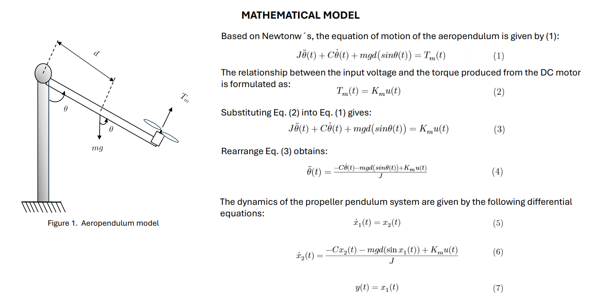
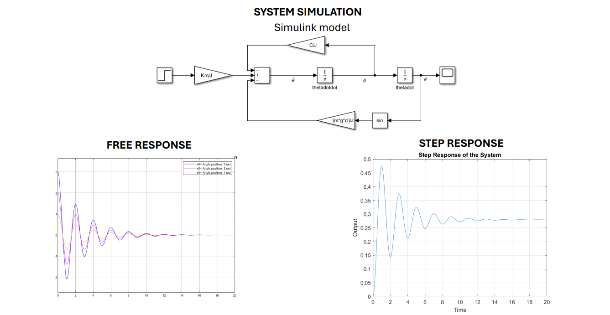
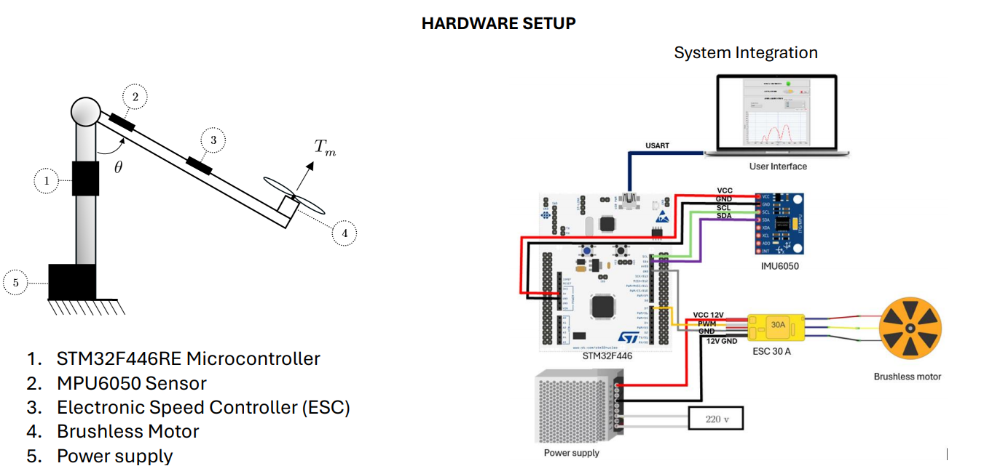
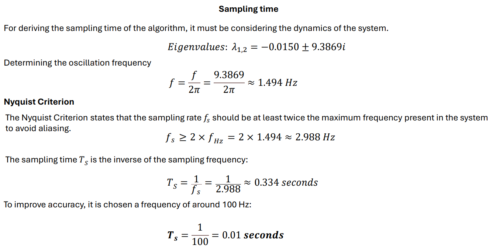
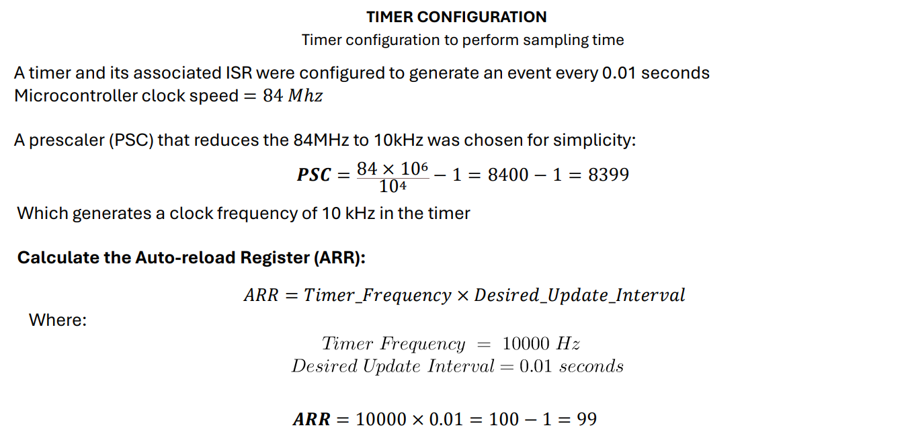
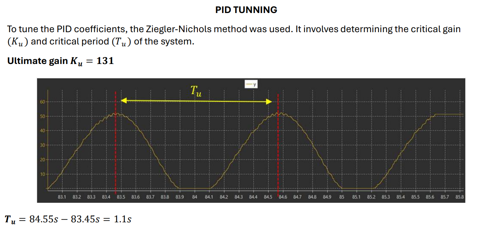
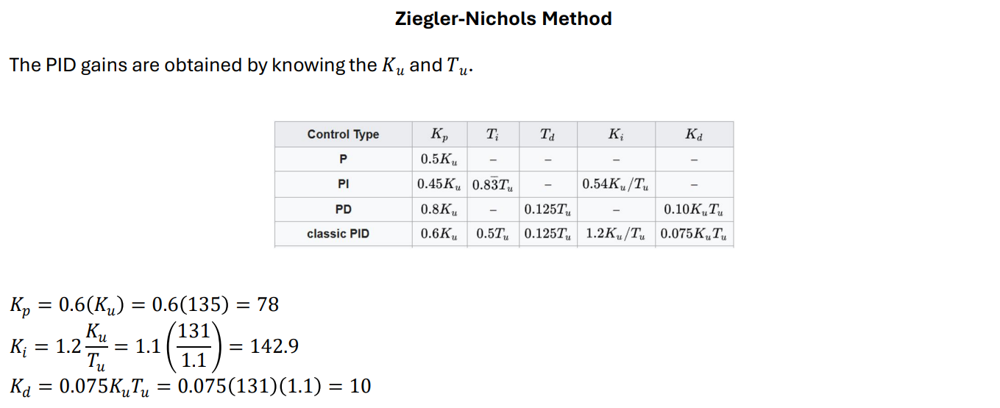
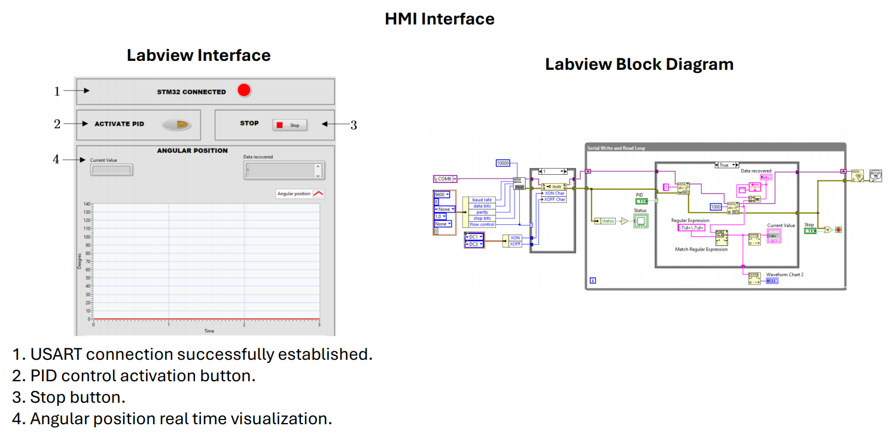
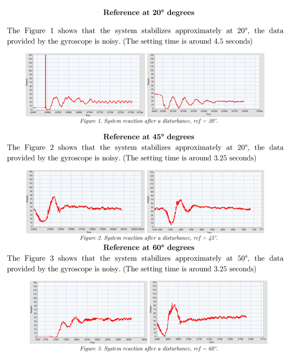

# Aeropendulum
Aeropendulum - PID control for angular position
# Description

<p align="center">
  
</p>
</br>
This project is centered on the development of a PID controller for the angular position of an aeropendulum. The primary goal was to apply concepts from system dynamics, control theory, and embedded systems programming.

The system's behavior was analyzed by deriving its mathematical model and performing simulations in MATLAB. Control theory principles, including Lyapunov stability, reachability, and controllability theorems, were used to evaluate the system's dynamics and characteristics. These analyses contributed to determining the appropriate sampling time for the system and served as a foundation for implementing a PID control algorithm.

The control logic was implemented using low-level programming techniques, leveraging direct register manipulation for peripheral configuration, including timers, interrupts, PWM signals, I2C, and USART communication protocols. This approach ensured efficient and precise control over the system's performance.

Following the implementation of the control logic, sensor fusion was employed to combine data from the accelerometer and gyroscope. A complementary filter was used to accurately determine the tilt position of the aeropendulum, providing reliable feedback for the control system.

A simple interface was developed in LabVIEW to facilitate system activation and deactivation, as well as to provide real-time feedback on the system's movement.

# Mathematical Model
To effectively control the propeller pendulum system, an accurate mathematical model of the dynamics of the system is first obtained.

  
# System Simulation
To carry out the simulation was designed a Simulink diagram that repre-sents the non-linear model from the system.  

  
# Hardware Setup
The aeropendulum system integrates several key components to achieve precise control and stabilization of an inverted pendulum mounted on a rotating base. The primary components include the STM32F446RE mi-crocontroller, the MPU6050 sensor, a brushless motor, and an Electronic Speed Controller (ESC). Each component plays a crucial role in the sys-tem's overall functionality.  


# Software design and implementation
The software for controlling the aeropendulum was developed using C and is executed on the STM32F445RE microcontroller. The system’s de-sign is centered around acquiring sensor data from the MPU6050, pro-cessing it with a complementary filter, and then using a PID controller to adjust the speed of brushless motor via PWM signals. A breakdown of the key components of the software is described:

## Main control loop
```c
  // Main loop to process incoming commands and execute PID control
  while (1) {
      // Check if new data has been received via USART
      if (new_data_available) {
    	  // Execute control logic when new data is available and the timer interrupt has fired (every 0.01 s)
          if (data_buff[0] == '1' && Tc_flag == 1) {

        	  float r = 45;								  // Desired setpoint (target angle)
              y = Get_Angle_Inclination();	              // Measure the current angle
              u = PID_Control(r, y);					  // Compute the control effort using PID
              TIM1->CCR1 = u;							  // Apply the control effort by setting the PWM duty cycle
              sprintf(buff_tx, "%1.3f\r\n", y);			  // Format the measured angle and send it via USART for feedback
              send_str_it(buff_tx, strlen(buff_tx));
              Tc_flag = 0;								  // Reset the control flag for the next cycle
          }
          else if (data_buff[0] == '0' && Tc_flag == 1) { // Command '0': Set motor PWM to a fixed value if Tc_flag is set

              TIM1->CCR1 = 500;							  // Set PWM to a fixed value (Stop the motor)
              Tc_flag = 0;								  // Reset the control flag
          }
      }
  }
``` 
# Sampling time



# PID Tunning
To tune the PID coefficients, the Ziegler-Nichols method was used. It involves determining the critical gain (K_u) and critical period (T_u) of the system by setting the integral and derivative gains to zero and gradually increasing the proportional gain until the system reaches sustained oscillations.


  
# HMI Interface
The Human Machine Interface (HMI) to control the aeropendulum was made using LABVIEW, it is a platform and development environment for designing systems, with a graphical visual programming language de-signed for testing, control and design hardware and software systems, simulated or real and embedded.

  
# PID Control Test
The test includes changing the reference of the desired angular position of the aeropendulum. The angles tested are 20°, 45° and 60° to ob-serve the response of the system and evaluate its ability to reach and maintain the setpoint under different conditions. The test aims to analyze the system's stability and the performance of the PID controller.



